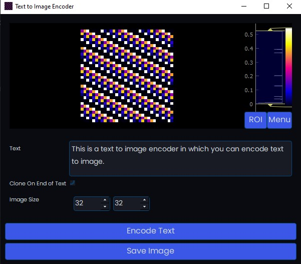

# Description
Encode Text to an image with controls for image size and whether to clone the text if the image size is bigger than the word count.



# Requirements
- PySide2
- pyqtgraph
- PIL
- numpy

# Build
Have the proper Python/Conda environment loaded in a terminal and run the ```buildApp.bat file``` to build the TextCode.exe file.

